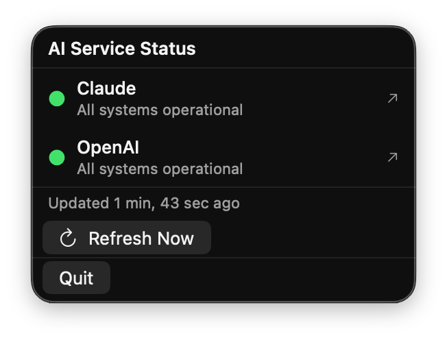

# AI Status Monitor

A lightweight macOS menu bar app that monitors the operational status of AI services — Claude (Anthropic) and OpenAI. Glance at your menu bar to instantly know if the APIs you depend on are up or having issues.



## Why?

If you build on top of Claude or OpenAI APIs, outages and degraded performance hit you directly. Instead of manually checking status pages, this app lives in your menu bar and tells you at a glance whether services are healthy — so you know immediately when something breaks.

## Features

- **Menu bar indicator** — green ●, orange ▲, or red ■ depending on overall health
- **Real-time status** for Claude and OpenAI via their RSS status feeds
- **Incident details** — see what's happening with a click
- **Click to open** — jump directly to the incident or status page in your browser
- **Auto-refresh** every 5 minutes + manual refresh button
- **No dock icon** — runs quietly in the menu bar only
- **Native macOS** — SwiftUI, single binary (~350KB), no Electron, no dependencies

## Status Indicators

| Icon | Meaning |
|------|---------|
| ● | All systems operational |
| ▲ | Incident on one service |
| ■ | Multiple services affected |

## Install

### Download

Grab the latest `AIStatusMonitor.app.zip` from [Releases](https://github.com/alexrett/ai-status-monitor/releases).

### Build from Source

Requires Xcode Command Line Tools and macOS 13+.

```bash
git clone https://github.com/alexrett/ai-status-monitor.git
cd ai-status-monitor
swift build -c release
open .build/release/AIStatusMonitor
```

Universal binary (Intel + Apple Silicon):

```bash
swift build -c release --arch arm64 --arch x86_64
```

### Create .app Bundle

```bash
swift build -c release --arch arm64 --arch x86_64

mkdir -p AIStatusMonitor.app/Contents/MacOS
cp .build/apple/Products/Release/AIStatusMonitor AIStatusMonitor.app/Contents/MacOS/

cat > AIStatusMonitor.app/Contents/Info.plist << 'EOF'
<?xml version="1.0" encoding="UTF-8"?>
<!DOCTYPE plist PUBLIC "-//Apple//DTD PLIST 1.0//EN" "http://www.apple.com/DTDs/PropertyList-1.0.dtd">
<plist version="1.0">
<dict>
    <key>CFBundleExecutable</key>
    <string>AIStatusMonitor</string>
    <key>CFBundleIdentifier</key>
    <string>com.malikov.ai-status-monitor</string>
    <key>CFBundleName</key>
    <string>AI Status Monitor</string>
    <key>CFBundlePackageType</key>
    <string>APPL</string>
    <key>CFBundleShortVersionString</key>
    <string>1.0</string>
    <key>LSUIElement</key>
    <true/>
    <key>LSMinimumSystemVersion</key>
    <string>13.0</string>
    <key>NSHighResolutionCapable</key>
    <true/>
</dict>
</plist>
EOF
```

## Monitored Services

| Service | Status Feed | Status Page |
|---------|------------|-------------|
| Claude (Anthropic) | `status.anthropic.com/history.rss` | [status.anthropic.com](https://status.anthropic.com) |
| OpenAI | `status.openai.com/history.rss` | [status.openai.com](https://status.openai.com) |

## Requirements

- macOS 13.0 (Ventura) or later
- Works on both Apple Silicon and Intel Macs

## License

MIT
